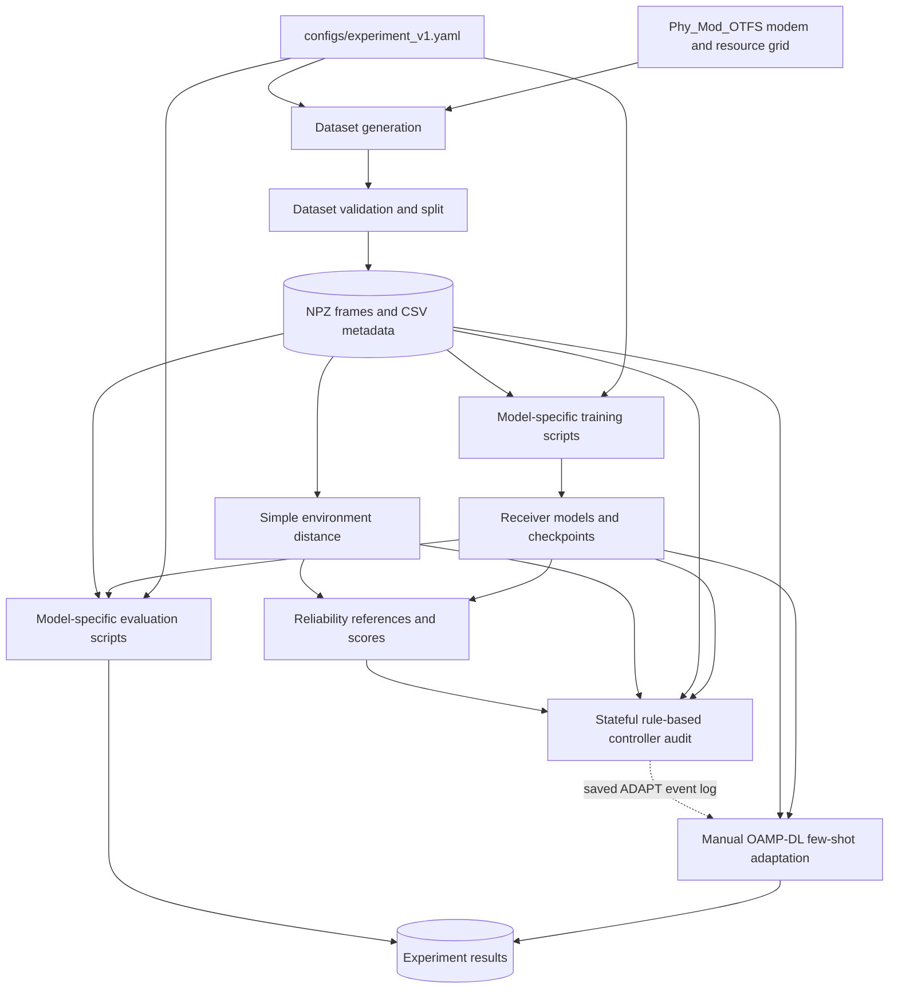

# Project Architecture

## Purpose and Scope

OTFS-NeuroRx is a Python research repository for generating simulated orthogonal time frequency space (OTFS) communication frames, training and evaluating symbol receivers, and prototyping monitoring and receiver-selection logic. Model-specific workflows remain command-line scripts; the root `run_pipeline.py` is the unified inference/controller entry point. Workflows read a shared YAML experiment configuration and write checkpoints, metrics, and intermediate artifacts beneath `experiments/`.

It is not currently a deployed receiver service. The unified entry point composes the existing frame-level environment feature, reliability references, receiver adapters, and controller for local single-frame or dataset-split runs. Adaptation remains an offline OAMP-DL-only operation; there is no production decision-and-retraining service.

## System Context



The diagram shows the intended artifact flow, with dashed ADAPT input emphasizing that adaptation is a separate offline operation. The controller audit receives the environment score as an input and records it, but the current decision policy does not use that score to select an action. The reliability detector's two-feature distance is also not the controller's routing score; the controller uses each receiver's confidence-margin reference.

## Repository Layers

| Path | Responsibility |
|---|---|
| `configs/` | Shared experiment YAML plus detector/controller JSON settings. |
| `datasets/otfs/` | Generated NPZ frame data, source metadata, and stratified split metadata. |
| `Phy_Mod_OTFS/` | Bundled OTFS modem, channel, detector, and resource-grid implementation used to synthesize and interpret frames. |
| `src/config/` | Lightweight YAML loader and configuration validation. |
| `src/receivers/` | Shared data-domain observation extraction and classical MMSE/OAMP receiver functions. |
| `models/dnn/` | Fully connected, MMSE-residual, and informed residual DNN receiver definitions. |
| `models/gnn/` | Bipartite message-passing GNN and prior-informed PI-EGNN. |
| `models/oamp/` | Learned unfolded OAMP-DL detector. |
| `models/supervisor/` | Environment feature extraction/scoring, reliability references, receiver adapters, and controller state machine. |
| `training/` | Model datasets, training entry points, shared trainer, feature-cache helpers, reference generation, and offline adaptation. |
| `evaluations/` | Test-split receiver evaluation and offline detector/controller audits. |
| `experiments/` | Checkpoints, histories, per-sample/per-condition metrics, and experiment reports. |
| `gpu_results/` | Copied GPU-run artifacts; not necessarily the configured destination for future runs. |
| `tests/` | Focused unit tests for environment scoring and controller behavior, plus bundled PHY toolbox tests. |

The repository currently has no root `requirements.txt` or `pyproject.toml`. The core Python workflow uses NumPy, pandas, PyYAML, PyTorch, and `textremo-toolbox`; the PyTorch build must match the machine's CPU/CUDA environment.

## Configuration and Dataset

The central configuration is `configs/experiment_v1.yaml`. It defines the V1 dataset contract, OTFS dimensions and physical settings, SNR/velocity sweep, pilot/guard layout, split ratios, model settings, and output paths. `src/config/loader.py` wraps nested YAML values for attribute access and validates core settings.

V1 contains 900 simulated frames across nine conditions: SNR 10, 15, or 20 dB and velocity 30, 120, or 500 km/h, with 100 frames per condition. Generation uses seed 42, a 4 GHz carrier, 15 kHz subcarrier spacing, four configured channel paths, maximum delay index 4, forced fractional Doppler, and 25 dB pilot SNR. The grid is 32 by 16 and carries 368 unit-power QPSK data symbols per frame.

`experiments/dataset_generation/generate_otfs_dataset.py` produces a frame by mapping data and pilots onto an OTFS resource grid, applying a random multipath channel and noise, demodulating, and estimating the channel from pilots. The raw files are compressed NPZs under `datasets/otfs/raw/`. Their principal arrays are:

| Array | Shape | Meaning |
|---|---:|---|
| `rx_dd` | `(16, 32)` | Received delay-Doppler grid. |
| `tx_dd` | `(368,)` | Transmitted data symbols; training target and offline scoring label. |
| `h_hat` | `(432, 368)` | Pilot-derived estimated data-domain channel used by informed receivers. |
| `h_dd` | `(432, 368)` | Simulated true channel, reserved for offline channel-estimation analysis and not a receiver input. |
| `his`, `lis`, `kis` | Variable | Channel path gains, delays, and Dopplers used as generation metadata. |

Source metadata is in `datasets/otfs/metadata/dataset_v1_metadata.csv`; the split file is `datasets/otfs/processed/dataset_v1_split.csv`. `experiments/dataset_preprocessing/preprocess_otfs_dataset.py` validates frames and assigns a deterministic, condition-stratified 70/15/15 split: 630 training, 135 validation, and 135 test frames, or 70/15/15 per condition. This is a within-condition split, not a held-out-condition design.

**Data safety:** generation and preprocessing currently target the fixed V1 paths and are capable of overwriting their artifacts. Do not run them against the existing dataset when preservation is required unless the scripts/configuration have first been isolated to a new output root.

## Receiver Architecture

All receivers estimate the 368 transmitted QPSK symbols. Most informed/model-driven receivers consume the received data-domain observation derived from `rx_dd`, `h_hat`, and noise power. Input contracts are receiver-specific; not every model receives the same features.

### Shared Classical Utilities

`src/receivers/mmse.py` reconstructs the data observation from the received grid and configured pilot/guard structure. The MMSE detector solves the regularized normal equations using `h_hat` and noise power. MMSE serves both as a baseline and as initialization/features for GNNs.

Plain analytical OAMP is implemented in `src/receivers/oamp.py`. It is a model-based baseline; OAMP-DL is a separate learned model.

### DNN Receivers

`models/dnn/` contains:

- `dnn_receiver.py`: fully connected receiver operating on `rx_dd` without explicit channel-estimate input.
- `mmse_residual_receiver.py`: predicts a correction to an MMSE symbol estimate.
- `informed_residual_receiver.py`: residual DNN with additional channel/residual information.

`training/dnn/dataset.py` loads received grids and targets, and can optionally return `h_hat`. Residual variants have their own dataset and entry points. `training/dnn/trainer.py` provides an AdamW-based training loop with validation loss, learning-rate scheduling, gradient clipping, early stopping, and best-checkpoint restoration.

### OAMP-DL

`models/oamp/oamp_dl.py` unfolds a fixed number of OAMP-like iterations and learns three scalar controls per iteration: step size, damping, and variance scaling. The default experiment uses 20 iterations, hence 60 learned scalar values. Its packed input contains the data observation, flattened `h_hat`, and noise power; its output is a complex vector of 368 symbol estimates. `training/oamp/` owns its dataset and trainer; `evaluations/oamp/` evaluates the saved model.

### Bipartite GNN and PI-EGNN

`models/gnn/otfs_gnn.py` represents the observation and transmitted-symbol dimensions as two node sets. Edges come from `h_hat` using the configured threshold; node/edge features pass through alternating message-passing and update layers. The original candidate uses an MMSE symbol estimate for initialization. A neutral initialization is retained as an ablation.

`models/gnn/pi_egnn.py` extends the bipartite graph receiver with an analytical OAMP prior, uncertainty/posterior features, and learned attention over active graph edges. Its analytical feature construction uses `rx_dd`, `h_hat`, noise power, MMSE, and OAMP calculations. `training/gnn/pi_egnn_cache.py` and related dataset helpers cache expensive derived features. The tested PI-EGNN run is a negative result relative to the original MMSE-initialized GNN and OAMP-DL; it remains experimental rather than replacing the original GNN.

## Training and Evaluation Flow

Each model family has its own training and evaluation entry points. Training uses the fixed train/validation split; evaluation reads the fixed test split and emits aggregate, per-sample, and, where applicable, per-condition results. Checkpoints and reports are kept by experiment under `experiments/`, such as `experiments/oamp_dl/` and `experiments/gnn_mmse_init/`.

The primary metrics are BER, SER, and NMSE. Receiver comparisons use common test frames and lower values are better. Overall V1 test means documented in the README put OAMP-DL ahead of the MMSE-initialized GNN and MMSE baselines. Per-condition test groups contain only 15 frames, so their confidence intervals are imprecise. The blind DNN's saved BER and SER summary is internally inconsistent and should not be ranked without re-evaluation.

Typical workflows, run from the repository root:

```text
python experiments/dataset_generation/generate_otfs_dataset.py
python experiments/dataset_generation/validate_otfs_dataset.py
python experiments/dataset_preprocessing/preprocess_otfs_dataset.py

python training/oamp/train.py --config configs/experiment_v1.yaml
python evaluations/oamp/evaluate.py --config configs/experiment_v1.yaml

python training/gnn/train.py --config configs/experiment_v1.yaml --initialization mmse
python evaluations/gnn/evaluate.py --config configs/experiment_v1.yaml
```

The full model-specific commands and PI-EGNN workflow are listed in `README.md`. Re-running training can overwrite configured model artifacts; preserve or copy checkpoints before doing so.

## Supervisor and Adaptation Components

### Environment Distance

The active simple implementation is `models/supervisor/simple_environment_detector.py`. For each frame it derives estimated SNR and a reconstruction-residual proxy from `rx_dd`, `h_hat`, the data observation, MMSE estimate, and configured noise power. A mean/std reference is built from training frames by `training/supervisor/prepare_simple_environment_detector.py`. It returns a stateless distance; it has no alarm threshold or memory.

Older predictive-rank/martingale logic in `models/supervisor/environment_features.py` and `models/supervisor/environment_change.py` is retained for reference and is not the active simple-distance path.

### Reliability References

`models/supervisor/reliability_detector.py` defines a per-receiver feature vector containing QPSK boundary margin and environment distance, plus per-receiver mean/std reference scoring. `training/supervisor/prepare_reliability_references.py` runs the frozen receiver bank on train/validation frames and saves references and audit features. The validation evaluator measures feature-to-error correlations offline. These scores are diagnostics, not probabilities of correctness.

### Controller Audit

`models/supervisor/reliability_controller.py` implements a stateful, sequential policy with `KEEP`, `SWITCH`, and `ADAPT` outcomes. It starts on OAMP-DL, waits for two consecutive low-confidence frames before requesting candidate margins, applies per-receiver confidence standardization and a switch gap, enforces a switch cooldown, and applies a frozen BER non-inferiority gate based on prior receiver-bank results. Candidate inference is lazy and is supplied by `models/supervisor/reliability_bank.py`.

There is an important boundary between the implemented components:

- The simple environment distance is computed from each frame and supplied to the controller for logging.
- The reliability-reference artifacts contain confidence and environment-distance features.
- **The current controller's action logic uses the active receiver's confidence z-score and candidate confidence z-scores; it does not use environment distance or the combined reliability distance to decide.**
- The BER/SER/NMSE labels are joined after routing for offline audit only.
- Controller `ADAPT` is a recommendation, not an in-process training call.

`evaluations/supervisor/evaluate_reliability_controller.py` runs the legacy sequential audit on the existing test split and reads its saved per-sample metric CSVs. The root `run_pipeline.py` is the unified entry point: it accepts a frame, a generated frame, an existing dataset split, or a freshly generated isolated dataset. Its batch path scores all frozen receivers freshly after each live decision and computes labels from each frame's `tx_dd`, so it does not depend on the legacy audit's original sample-index tables. Existing test artifacts have been used repeatedly; they are not fresh generalization evidence.

### Few-Shot OAMP-DL Adaptation

`training/supervisor/adapt_oamp_dl_fewshot.py` is a separate offline experiment driven by a saved controller decision log. As implemented for the registered original-data condition, it requires two OAMP-DL ADAPT events at 10 dB/500 km/h, fine-tunes only `step_logits`, `damping_logits`, and `variance_logits` on 15 validation frames for 20 fixed AdamW steps, and writes a distinct adapted checkpoint under `experiments/oamp_dl_adapt_snr10_v500/`. It evaluates on held-out frames afterward. It does not overwrite the base checkpoint, retrain another receiver, promote a checkpoint, or automatically adapt on each future controller event.

## Tests, Artifacts, and Operational Caveats

Focused unit tests live in `tests/`, including tests for the simple environment detector and reliability controller. The bundled `Phy_Mod_OTFS/Tests/` tree contains toolbox tests, which are broader than the receiver/supervisor tests.

Important constraints when interpreting results:

- `h_dd` and `tx_dd` are not live routing inputs. `tx_dd` is used as a training target and for offline metrics; `h_dd` is ground truth for offline analysis.
- The current dataset generator fixes its output directories and obtains its RNG seed from the experiment config. Independent-data runs need an isolated output root and a seed change; otherwise original data/metadata can be overwritten.
- The controller evaluator loads precomputed per-sample labels tied to the original test indices. It cannot be pointed at new frames and expected to produce valid metrics without a path that freshly evaluates each receiver on those frames.
- The controller currently uses prior fixed receiver BERs for its candidate gate. This is part of the locked policy, not a live estimate of a candidate's current-frame BER.
- `run_pipeline.py --generate-dataset` performs isolated independent-data generation, fresh all-receiver scoring, live controller replay, and OAMP-DL few-shot adaptation when the controller recommends OAMP-DL and a condition-matched validation split is available.
- The 135-frame test split has already informed repeated model and controller evaluations. It is useful for integration checks, not new confirmatory claims.

See `README.md` for the latest experiment-specific status, reported metrics, commands, and artifact locations. This document describes code structure and component contracts; the README carries current experimental results.